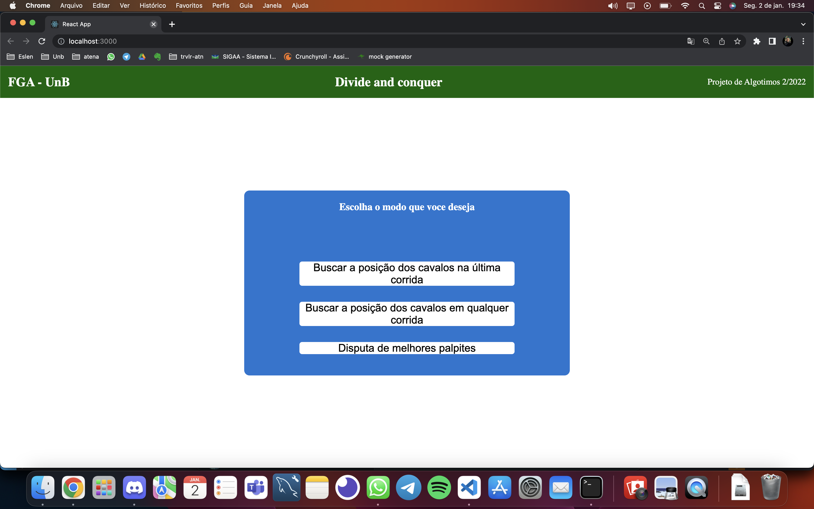
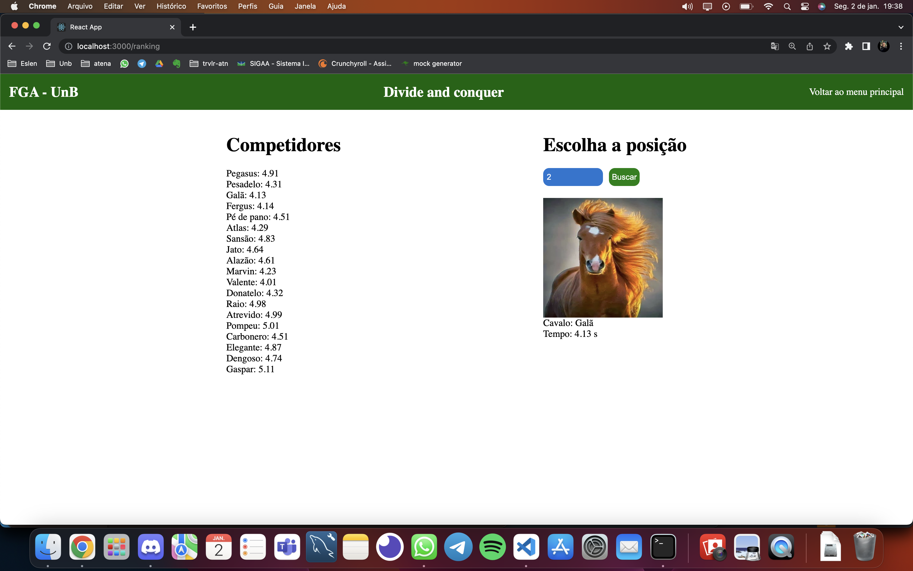
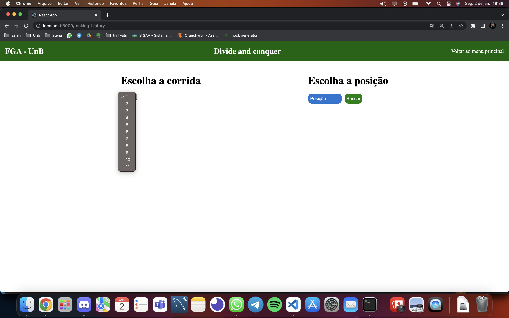
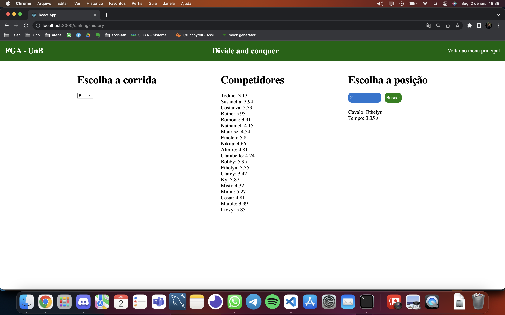
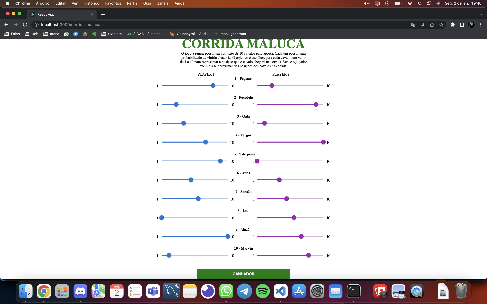
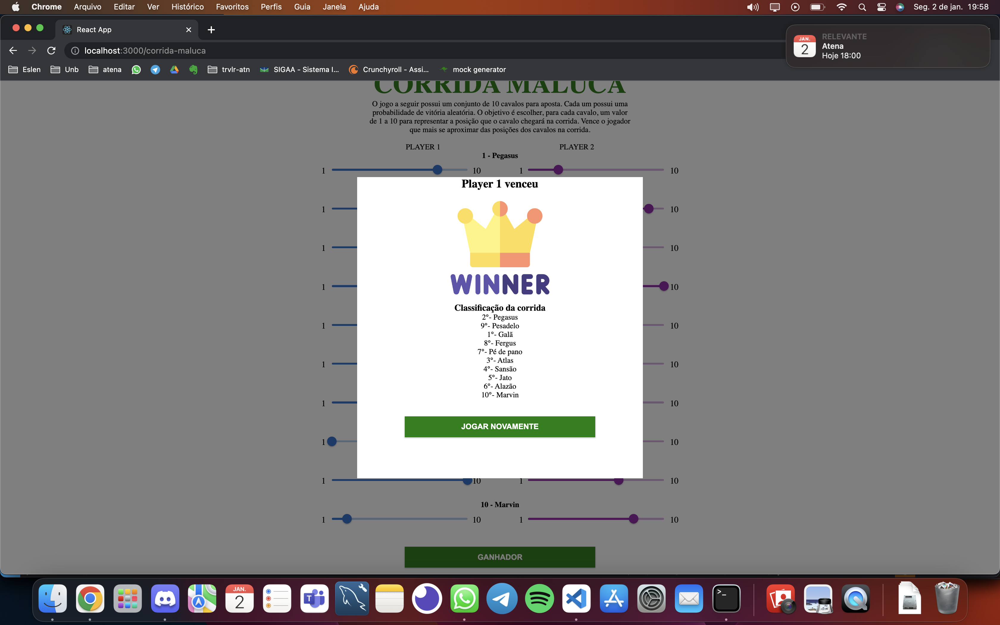

# DC_JogadorParecido

**Número da Lista**: 04<br>
**Conteúdo da Disciplina**: D&C<br>

## Alunos
|Matrícula | Aluno |
| -- | -- |
| 18/0042386 |  Kevin Batista |
| 18/0011600  |  Ailton Aires |

## Sobre 

Num ambiente de jockey club as pessoas gostam de analisar os rankings de cada corrida e as vezes até mesmo participar de algumas jogatinas. Isso é o que o projeto tem como objetivo através do uso de algoritmos de dividir e conquistar. A busca pelas posições é feita pela mediana das medianas e o joguinho da corrida maluca foi desenvolvido com a contagem de inversões.


## Screenshots
### - Tela Inicial



### - Tela na busca da ultima corrida


### - Tela na busca da ultima corrida após a busca


### - Tela na busca de todas as corridas


### - Tela na busca da ultima corrida após a busca


### - Tela após finalizar Date Guessing



## Instalação 
**Linguagem**: Javascript<br>
**Framework**: React<br>

## Instalação

**Linguagem**: JavaScript<br>
**Framework**: React<br>
É necessário possuir o node instalado na máquina.

```powershell
# Clone o repositório
git clone git@github.com:projeto-de-algoritmos/DC_JockeyClub.git

# Entre no diretório e instale as dependencias
cd DC_JockeyClub && npm install
````

## Uso

```powershell
# Inicie o projeto
npm start

# Visite o endereço localhost:3000 no seu navegador
```

## Outros 

- O vídeo da apresentação pode ser encontrado dentro do repositório no caminho "video/apresentacao.mp4".


